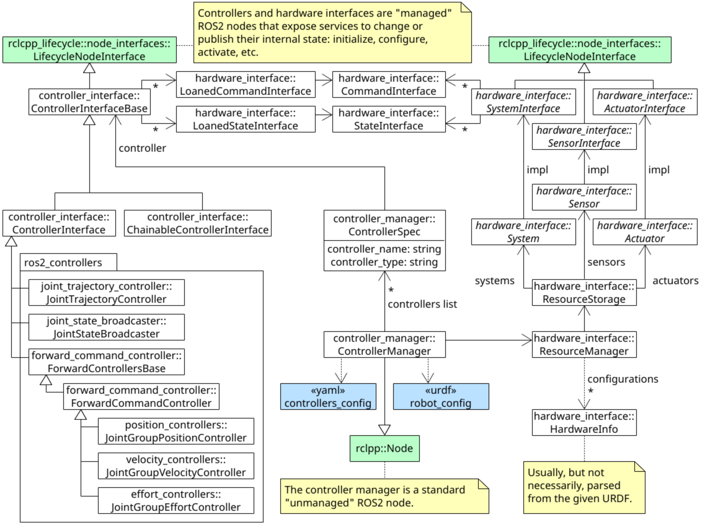

# DOC
https://control.ros.org/master/doc/getting_started/getting_started.html

https://control.ros.org/master/doc/ros2_control_demos/example_7/doc/userdoc.html

https://github.com/orocos/orocos_kinematics_dynamics

# launch simul
```bash
ros2 launch braccio_control braccio_controller.launch.py

ros2 launch braccio_control send_trajectory.launch.py
```
# Architecture


### ros2 control framework



## Control manager

connects the controllers and hardware-abstraction.
CM manages (e.g. loads, activates, deactivates, unloads) controllers and the interfaces they require. On the other hand, it has access (via the Resource Manager) to the hardware components, i.e. their interfaces. The Controller Manager matches required and provided interfaces, granting controllers access to hardware when enabled, or reporting an error if there is an access conflict.

The execution of the control-loop is managed by the CM’s update() method. It reads data from the hardware components, updates outputs of all active controllers, and writes the result to the components

## Resource Manager
abstracts physical hardware and its drivers (called hardware components) for the ros2_control framework. The RM loads the components using the pluginlib-library, manages their lifecycle and components’ state and command interfaces. The abstraction provided by RM allows reuse of implemented hardware components

In the control loop execution, the RM’s read() and write() methods handle the communication with the hardware components.

## Controllers
are based on control theory. They compare the reference value with the measured output and, based on this error, calculate a system’s input. The controllers are objects derived from ControllerInterface (controller_interface package in ros2_control) and exported as plugins using pluginlib-library.

When the control-loop is executed, the update() method is called. This method can access the latest hardware state and enable the controller to write to the hardware command interfaces.

## User Interfaces
Users interact with the ros2_control framework using Controller Manager’s services. For a list of services and their definitions, check the srv folder in the controller_manager_msgs package.

## Hardware Components
ealize communication to physical hardware and represent its abstraction in the ros2_control framework. The components have to be exported as plugins using pluginlib-library. The Resource Manager dynamically loads those plugins and manages their lifecycle.
**System**

    Complex (multi-DOF) robotic hardware like industrial robots. The main difference between the Actuator component is the possibility to use complex transmissions like needed for humanoid robot’s hands. This component has reading and writing capabilities. It is used when there is only one logical communication channel to the hardware (e.g., KUKA-RSI).
**Sensor**

    Robotic hardware is used for sensing its environment. A sensor component is related to a joint (e.g., encoder) or a link (e.g., force-torque sensor). This component type has only reading capabilities.
**Actuator**

    Simple (1 DOF) robotic hardware like motors, valves, and similar. An actuator implementation is related to only one joint. This component type has reading and writing capabilities. Reading is not mandatory if not possible (e.g., DC motor control with Arduino board). The actuator type can also be used with a multi-DOF robot if its hardware enables modular design, e.g., CAN-communication with each motor independently.


# DOC

## ros2_control overview
**state_interfaces** and **command_interfaces** to abstract hardware interfacing. 
- The **state_interfaces** are read only data handles that generally represent sensors readings.
- The **command_interfaces** are read and write data handles that hardware commands (exclusively accessed , 1 can use it)

provides the **ControllerInterface** and **HardwareInterface**.

controllers request **state_interfaces** and **command_interfaces** required for operation through the ControllerInterface

hardware drivers offer **state_interfaces** and **command_interfaces** via the HardwareInterface

ros2_control ensure all requested interfaces are available before starting the controllers. The interface pattern allows vendors to write hardware specific drivers that are loaded at runtime.

- read call, hardware drivers that conform to HardwareInterface update their offered state_interfaces with the newest values received from the hardware
- update call, controllers calculate commands from the updated state_interfaces and writes them into its command_interfaces
- write call, the hardware drivers read values from the command_interfaces and sends them to the hardware

ros2_control_node runs 
- the main loop in a realtime thread.
- second non-realtime thread to interact with ROS publishers, subscribers, and services.

## Writing a URDF

- The <link name="world"/> and <link name="tool0"/> elements are not required. However, it is convention to set the link at the tip of the robot to tool0 and to define the robot’s base link relative to a world frame.

- The ros2_control tag specifies hardware configuration of the robot. More specifically, the available state and command interfaces. The tag has two required attributes: name and type. Additional elements, such as sensors, are also included in this tag.

- The hardware and plugin tags instruct the ros2_control framework to dynamically load a hardware driver conforming to HardwareInterface as a plugin. The plugin is specified as <{Name_Space}/{Class_Name}.

- Finally, the joint tag specifies the state and command interfaces that the loaded plugins will offer. The joint is specified with the name attribute. The command_interface and state_interface tags specify the interface type, usually position, velocity, acceleration, or effort.

test xacro:
```bash
xacro braccio_simulation/model/urdf/braccio.urdf.xacro > braccio.urdf
urdf_to_graphviz braccio.urdf braccio
```


### More info
The mimic joints must not have command interfaces but can have state interfaces.


## hardware interface

hardware system components are integrated via user defined driver plugins that conform to the HardwareInterface public interface. Hardware plugins specified in the URDF are dynamically loaded during initialization using the pluginlib interface. In order to run the ros2_control_node, a parameter named robot_description must be set. This normally done in the ros2_control launch file.

The hardware plugin for the tutorial robot is a class called **RobotSystem** that inherits from **hardware_interface::SystemInterface**. The SystemInterface is one of the offered hardware interfaces designed for a **complete robot system**.  must implement the following public methods:
- on_init: communication between the robot hardware needs to be setup and memory dynamic should be allocated
create a communication with "braccio_control/positions"
- on_configure: Initial values are set for state and command interfaces that represent the state all the hardware
- read: loops over all hardware components and calls the read method. It is executed on the realtime thread, hence the method must obey by realtime constraints. The read method is responsible for updating the data values of the state_interfaces. Since the data value point to class member variables, those values can be filled with their corresponding sensor values, which will in turn update the values of each exported StateInterface object.
- write: It is called after update in the realtime loop. For this reason, it must also obey by realtime constraints. The write method is responsible for updating the data values of the command_interfaces. As opposed to read, write accesses data values pointer to by the exported CommandInterface objects sends them to the corresponding hardware

## controller

controllers exists in a finite set of states:
- Unconfigured
- Inactive
- Active
- Finalized
managed states:
- on_init: only once during the lifetime for the controller, hence memory that exists for the lifetime of the controller should be allocated. the parameter values for joints, command_interfaces and state_interfaces should be declared and accessed.
- on_configure: Reconfigurable parameters should be read in this method. publishers and subscribers should be created.
- command_interface_configuration: returns a list of InterfaceConfiguration objects to indicate which command interfaces the controller needs to operate. The command interfaces are uniquely identified by their name and interface type. If a requested interface is not offered by a loaded hardware interface, then the controller will fail.
- state_interface_configuration: list of InterfaceConfiguration objects representing the required state interfaces to operate is returned
- on_activate: should handle controller restarts, such as setting the resetting reference to safe values. It should also perform controller specific safety checks. The command_interface_configuration and state_interface_configuration methods are also called again when the controller is activated.
- update: part of the realtime control loop, the realtime constraint must be enforced.The controller should read from its state interfaces, read its reference and calculate a control output. the reference is accessed via a ROS 2 subscriber. Since the subscriber runs on the non-realtime thread, a realtime buffer is used to a transfer the message to the realtime thread. The realtime buffer is eventually a pointer to a ROS message with a mutex that guarantees thread safety and that the realtime thread is never blocked. The calculated control output should then be written to the command interface, which will in turn control the hardware.
- on_deactivate
- on_cleanup
- on_error
- on_shutdown

## controller interface


